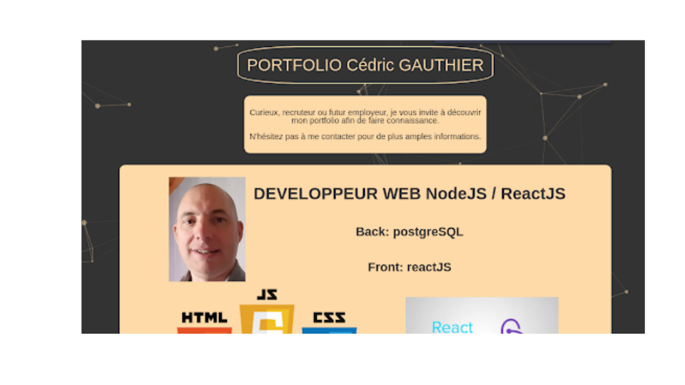

# Potfolio

<!-- ABOUT THE PROJECT -->
## About The Project



Finally, and because it is essential: my **portfolio**, a presentation of my background, my projects and my achievements

Project online : [588dev.org](http://588dev.org/)
### Built With

* 🖊️ Markdown
* 🐙 Github
* 💻 VS Code

## Getting Started

To get a local copy up and running follow these simple steps.

### Prerequisites

This is an example of how to list things you need to use the software and how to install them.
* Git
  
In a shell:
```sh
sudo apt-get install git
```

### Installation
 
1. Clone the repo
   
   In a shell:
```sh
git clone https://github.com/CedricGAUTHIER/Portfolio
```
2. Open VS Code
3. Install Markdown Preview Enhancement plugin
4. Open the README.md file and execute the following command
```sh
ctrl+k v
```


<!-- USAGE EXAMPLES -->
## Usage

You are a recruiter, and maybe my future employer or you are just curious: take a look and do not hesitate to contact me for more information.


<!-- CONTACT -->
## Contact

Cédric GAUTHIER :

📬 cgauthier.dev@gmail.com

[](https://www.linkedin.com/in/cedric-gauthier/)

Project Link: [https://github.com/CedricGAUTHIER/Portfolio](https://github.com/CedricGAUTHIER/Portfolio)


<!-- ACKNOWLEDGEMENTS -->
## Acknowledgements

* This readme version is a simplified version of this [github repository](https://github.com/othneildrew/Best-README-Template) by Othneildrew
